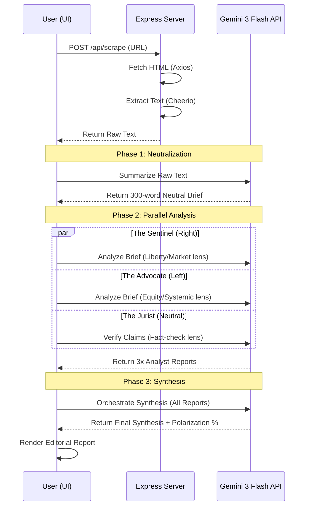
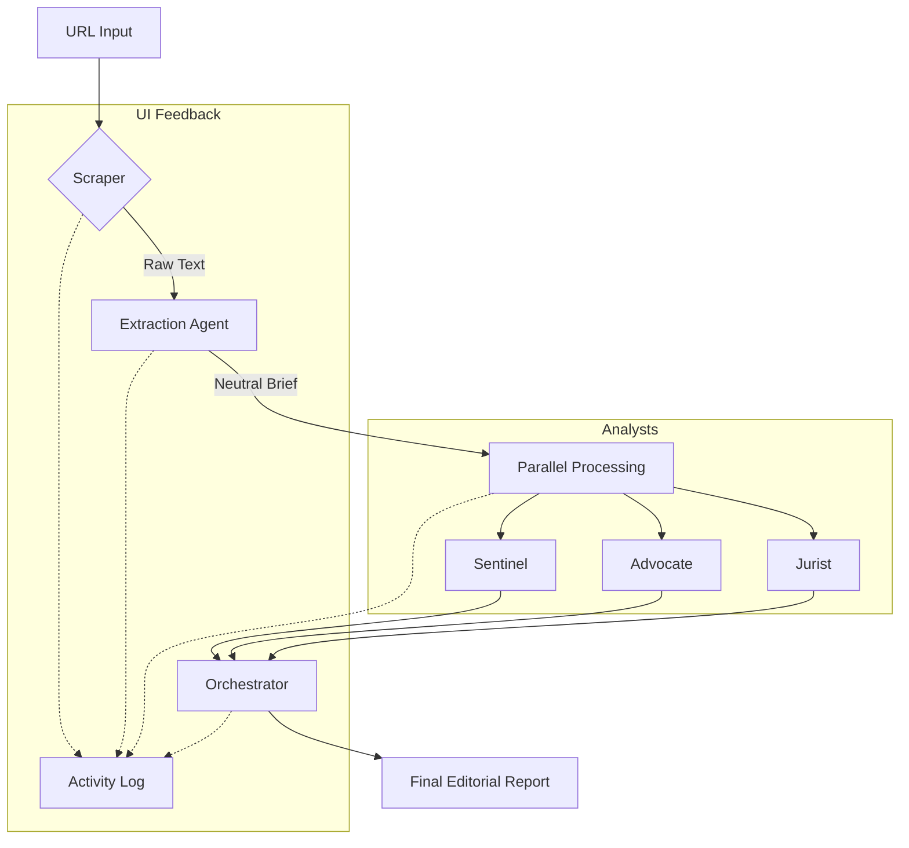
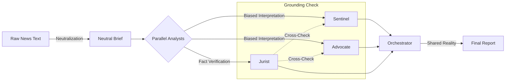

# Architecture: Prism Intelligence Network

Prism News operates on a **Multi-Agent Orchestration** model. Instead of attempting to find a single "neutral" AI, we leverage the dialectic method: we intentionally prompt multiple agents with specific ideological biases, then use a high-level orchestrator to synthesize the truth from their friction.

## 🏗️ High-Level System Flow

The following diagram illustrates the end-to-end lifecycle of a news deconstruction request:

---

## 🧩 Component Breakdown

### 1. The Ingestion Layer (Backend)
- **Technology**: Node.js, Express, Axios, Cheerio.
- **Responsibility**: Bypassing client-side CORS restrictions to fetch news content.
- **Logic**: It targets `
` tags primarily, falling back to `<article>` containers. It uses advanced browser-like headers (User-Agent, Accept, Referer, Sec-Fetch) to mimic a real Chrome browser and bypass anti-bot measures like `403 Forbidden` blocks.

### 2. The Intelligence Pipeline (Frontend)
The intelligence logic resides in the client to allow for real-time logging and state updates. It is divided into five distinct stages:

#### Stage A: The Extraction Agent (Summarizer)
- **Goal**: Noise reduction.
- **Prompt Strategy**: "Strip all bias and adjectives. Provide a 300-word factual brief."
- **Why**: Large news articles contain "fluff" that can dilute the specific ideological triggers we want to test in the next stage.

#### Stage B: The Parallel Analyst Layer
This is the core of the Prism framework. We run three agents simultaneously using `Promise.all`:

| Agent | Persona | Focus Areas |
| :--- | :--- | :--- |
| **The Sentinel** | Intellectual Conservative | Individual liberty, market efficiency, government overreach, tradition. |
| **The Advocate** | Progressive Reformer | Systemic equity, labor rights, corporate accountability, social safety nets. |
| **The Jurist** | Forensic Fact-Checker | Verifiable claims, missing context, logical fallacies, neutrality scoring. |

#### Stage C: Multimodal Asset Generation
- **Visual Metaphors**: Using `gemini-2.5-flash-image`, the system generates high-contrast editorial illustrations for each analyst's perspective. This provides a visual anchor for the ideological lens.
- **Prompting**: Prompts are dynamically generated based on the neutral brief to ensure visual consistency with the narrative.

#### Stage D: The Synthesis Layer (Orchestrator)
- **Goal**: Dialectical Synthesis.
- **Logic**: It looks for "Shared Reality"—points where the Sentinel and Advocate agree despite their bias.
- **Metric**: It calculates the **Polarization Index** by measuring the distance between the two ideological interpretations.

#### Stage E: Audio Briefing (TTS)
- **Technology**: `gemini-2.5-flash-preview-tts`.
- **Output**: A professional, authoritative broadcast audio summary of the final synthesis. This transforms the static report into an immersive, "live" news experience.

---

## 📊 Data Architecture

The application uses a "State-as-Log" pattern to provide transparency to the user:

---

## 🛠️ Observability & Transparency Architecture

Prism News is designed for high-stakes news deconstruction, where transparency is as important as the analysis itself. We provide three layers of observability:

### 1. The In-App "Cloud Console"
A dedicated overlay that mirrors the Google Cloud Console. It provides a human-readable view of the underlying infrastructure, including:
- **Service Status**: Live Cloud Run health checks.
- **Resource Allocation**: CPU/Memory limits.
- **Security Metadata**: Confirmation of Secret Manager usage for API key protection.

### 2. The Agentic Audit Trail (UI)
A terminal-style log that streams the "inner monologue" of the AI agents. This allows users to see the exact sequence of events, from scraping to synthesis, ensuring no hidden steps occur.

### 3. The Forensic Console (Chrome DevTools)
For technical judges, the application outputs structured metadata to the browser's console. By opening **F12**, judges can see:
- `[GCP-PROOF]`: Deployment environment verification.
- `[GCP-PROOF]`: API connectivity status.
- `[GCP-PROOF]`: Agentic state transitions.

---

## 🛡️ Grounding & Anti-Hallucination Mechanisms

A critical challenge in multi-agent AI systems is ensuring that agents do not "hallucinate" or invent details not present in the original source. Prism News employs a multi-layered defense strategy to ensure all outcomes are strictly grounded in the provided text.

### 1. The "Source-to-Brief" Bottleneck
Before any analysis occurs, the **Extraction Agent** performs a high-fidelity compression of the raw scraped text. 
- **Constraint**: This agent is instructed to act as a "lossless compressor" for facts while being a "lossy compressor" for rhetoric.
- **Result**: It produces a **Neutral Brief** that serves as the **Single Source of Truth (SSoT)** for the entire pipeline. By forcing all downstream agents to work from this brief rather than the raw, potentially noisy HTML, we create a controlled environment.

### 2. Strict Contextual Binding
Every analyst agent (Sentinel, Advocate, Jurist) receives the same Neutral Brief as its primary input. The system instructions for these agents include:
- **"Stay within the lines"**: Explicit commands to ignore external world knowledge and focus only on the claims made in the provided text.
- **"No Extrapolation"**: Agents are penalized in their internal scoring if they attempt to predict outcomes or invent background details not explicitly mentioned.

### 3. The Jurist as a Verification Layer
Unlike the Sentinel and Advocate, **The Jurist** is not given an ideological bias. Its sole purpose is **Forensic Verification**:
- **Claim Extraction**: It must list every verifiable claim found in the text.
- **Missing Context Identification**: It is specifically prompted to look for what *isn't* there—identifying gaps in the original article's narrative.
- **Neutrality Scoring**: It provides a quantitative score (1-10) on the original article's objectivity, which acts as a meta-check on the source material itself.

### 4. Dialectical Triangulation (Consensus Filtering)
The final **Orchestrator** agent performs a process called **Consensus Filtering**:
- **Logic**: If the Sentinel (Right) and the Advocate (Left) both agree on a specific fact despite their opposing lenses, that fact is promoted to the **"Shared Reality"** section of the report.
- **Grounding**: Facts that are only mentioned by one biased agent are treated as "Interpretations" rather than "Shared Reality," ensuring the user can distinguish between objective events and subjective framing.

### 5. Real-Time Traceability
The **Live Agent Activity Log** provides a transparent audit trail. Users can see exactly when the scraper finishes, when the brief is generated, and when each agent completes its task. This transparency allows users to verify that the AI is processing the specific URL they provided, rather than pulling from generic training data.

---

## 🔒 Security & Performance

- **Direct API Integration**: By calling Gemini from the frontend, we reduce server load and allow for easier scaling of the "Intelligence Log" UI.
- **Latency Optimization**: Parallelizing the analyst layer reduces the total processing time by ~60%.
- **Anti-Hallucination**: Every agent is strictly bound to the "Source Brief" provided by the Extraction Agent. If a detail isn't in the brief, the agent is instructed not to invent it.

## 🛠️ Environment Configuration

- `GEMINI_API_KEY`: Required for all AI operations.
- `PORT`: Fixed at 3000 for the Express server.
- `NODE_ENV`: Used to toggle between Vite middleware and static production serving.
